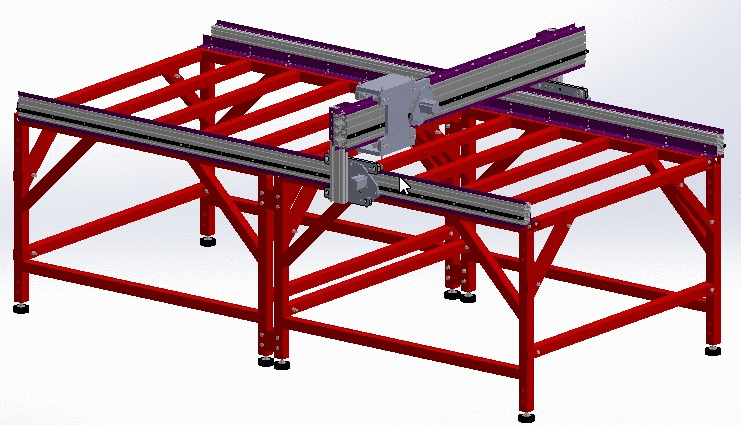

Swarfy
=========

Design plans for a 3m x 1.5m CNC machine I have built.

The mechanical design is based off a Joe's Evolution CNC.

The mechanical design was done using SolidWorks and the Electrical 
design was done using KiCad.

I'm in the process of documenting the build so bear with me.

